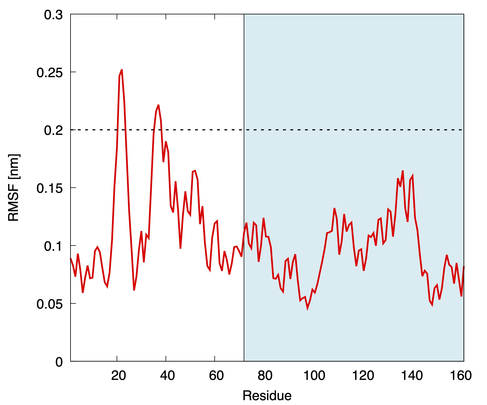
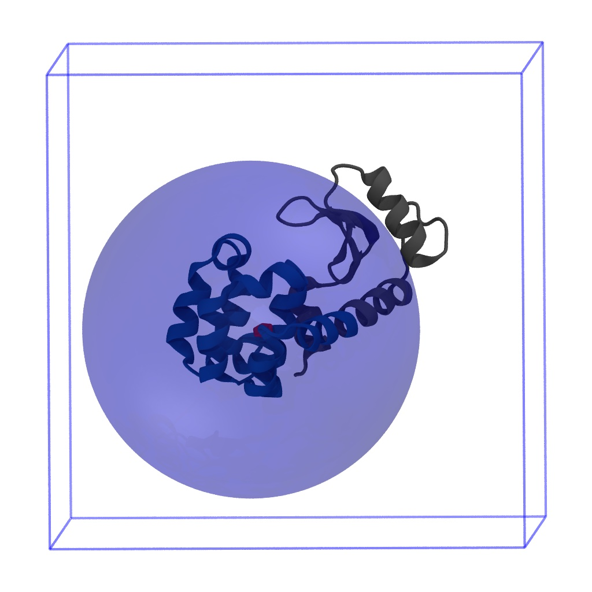

# Input files preparation

In the zip file available in the GitHub repository you will find all the initial files needed to run this tutorial.

## Preliminary molecular dynamics run
As a first step for the VMetaD run, we have to choose the atoms which will constitute the reference frame on which we will calculate the position of the ligand with respect to the protein. To be sure in choosing residues that remain stable (i.e. do not belong to a moving loop), we run a 100 ns-long plain molecular dynamics (MD) simulation (it took 2 h on 4 CPUs of a M1 Max MacBook Pro).

After the simulation, we calculate the per-residue root mean square fluctuations (RMSF), which highlights the more dynamic residues.

<p align="center">
  
  <br>
  <em>Per-residue root mean square fluctuation (RMSF) computed from a plain MD simulation of lysozyme-benzene complex. The portion of the plot with light blue background represents the C-terminal domain, where the benzene binds.</em>
</p>

We can see that almost all the C-terminal domain (residues 71-162) does not show large fluctuations, and only few residues are above the (arbitrary) RMSF threshold of 0.15 nm. We thus consider to define the reference frame considering all the residues 71-162 but the five ones with RMSF > 0.15 nm (residues 135, 136, 137, 140, and 141).

## Choice of the restraining potential size

We now need to choose the size of the restraint potential. In the [original paper](https://doi.org/10.1021/acs.jpclett.9b01183) we showed that the reliability of the estimates is not affected by the size of the potential. However, we have to keep in mind that we need a part of the box where the ligand can stay far away from the protein in order to represent the unbound state in a satisfactory way. An important point here is that the sphere constraint __must__ be inside the box, otherwise the entropic correction will not accurately account for the loss of configurational space. To visually inspect how large the potential is, and to get a feel for the possible movements of the ligand, we can visualize both the system and the restraint with VMD (downloadable [here](https://www.ks.uiuc.edu/Research/vmd/)).

We can open VMD and load the `starting.gro` structure file in the GitHub folder. After the structure is loaded and the visualization has been set up at your taste, you can open the Tk console and write
```
pbc box
```
which draws the cubic box in which the system is inserted. 

Now we can generate the atom selection we defined after checking the RMSF:
```
set sel [atomselect top "resid 71 to 134 or resid 138 to 139 or resid 142 to 162"]
```
The console should answer
```
atomselectXX
```
Where `XX` is a number. The selection for the reference frame has been defined and named `$sel`. Now we can compute the position of the center of mass of this set of atoms:
```
measure center $sel weight mass
```
The console should answer with the position of the center of mass (in Ångstrom)
```
35.28876876831055 34.06196594238281 32.041622161865234
```
Knowing this information, we can draw the sphere with a radius of (for example) 2 nm  (20 Å) with the following command
```
draw sphere {35.28876876831055 34.06196594238281 32.041622161865234} radius 20 resolution 100
```
Receiving a number as an answer from the console. Such number is the ID of the 3D object we just draw. The drawn sphere is opaque, not allowing us to see inside it; to make it transparent, we need to specify that we want a transparent material
```
draw material Transparent
```
We can see that the sphere contains the entire domain, but it is probably too small to represent the unbound state in a precise way. Let's delete the sphere using the ID of the 3D object (let's say that it is `14`), and plot a new sphere of radius 2.8 nm
```
draw delete 14
draw sphere {35.28876876831055 34.06196594238281 32.041622161865234} radius 28 resolution 100
```

You can see the expected result below
<p align="center">
  
  <br>
  <em>Cartoon representation of the lysozyme-benzene complex, including the restraining potential applied within a 2.8 nm radius of the reference frame center of mass. The boundaries of the simulation box are also highlighted to show that the sphere is entirely contained by the box. </em>
</p>

## The C-alpha RMSD restraining
One effect that we should take into account is the possibility that the ligand, in advanced phases of the simulation, will try to unfold the protein, being the place occupied by it the volume portion with less history-dependent potential. To limit this effect we will put in place a RMSD restraining that will be removed during the reweighting procedure. To be sure to keep the structure stable, we will consider all the C-alpha atoms of the residues considered for defining the reference frame. This is not the case, but in presence of partial folding upon binding effects the involved residues can be removed from this restraint. 

To have a reference structure to be used in PLUMED (see the next section for the input file), we convert the initial structure to the PDB format using `gmx editconf`  (to be sure about the numbering) and keeping only the C-alphas:
```
gmx editconf -f starting.gro -o ref_ca.pdb
grep "CA" ref_ca.pdb > tmpfile && mv tmpfile ref_ca.pdb
```
Adding the correct values to the b-factor columns so that PLUMED can consider only the atoms we want to select (see the `ref_ca.pdb` file in the folder for reference).
This PDB file will also be used to perform the rototranslational fit of the host to fix the reference frame (we can also use two different files with different groups of atoms, if necessary).

## The PLUMED input file
_(You can read the following line-by-line description keeping an eye on the `plumed.dat` file in the GitHub folder as a reference)_

### Reference frame setup
We start with the `WHOLEMOLECULES` instruction, to be sure that lysozyme (`ENTITY0`) will not be broken by the periodic boundary condition, as well as the benzene molecule (`ENTITY1`):
```
WHOLEMOLECULES ENTITY0=1-1284 ENTITY1=1285-1290
```
Now that we are sure of the integrity of the structures in PLUMED, we perform the rototranslational fit of the system to make sure that the protein will be in the fixed reference frame position:
```
FIT_TO_TEMPLATE REFERENCE=ref_ca.pdb TYPE=OPTIMAL
```

We then start with the groups definition. We previously prepared a GROMACS index file (`index.ndx`) with all the groups named as intended. As an alternative, you can also define such groups with atom ids.
```
prot_noh: GROUP NDX_FILE=index.ndx NDX_GROUP=Protein-H
sph: GROUP NDX_FILE=index.ndx NDX_GROUP=sphere
lig: GROUP NDX_FILE=index.ndx NDX_GROUP=ligand
```
We have three groups: 
* `prot_noh`, which contains all the non-hydrogen atoms of the protein (for our multi-eGO potential is equivalent to all the protein, but in all-atom representation it makes a difference);
* `sph`, which contains the atoms that define the reference frame (the C-alpha of the selected residues -see above-);
* `lig`, which contains the atoms of the ligand.

After the definition of the groups, to avoid that the passage in a periodic boundary conditions causes a "jump" of the ligand with respect to the protein, we add a `WRAPAROUND` instruction:
```
WRAPAROUND ATOMS=lig AROUND=sph
```
Ending the fitting part of the PLUMED input.

### Spherical coordinates definition
We now compute the position of the center of mass of the atoms defining the reference frame ($$(x,y,z)=(0,0,0)$$ in our CV space), and the center of mass of the ligand:
```
sph_center: COM ATOMS=sph
lig_center: COM ATOMS=lig

sph_coord: POSITION ATOM=sph_center NOPBC
lig_coord: POSITION ATOM=lig_center NOPBC
```
From the position, we can obtain the cartesian coordinates of the ligand in this reference frame
```
abs_x: MATHEVAL ARG=bnz_coord.x,sph_coord.x FUNC=x-y PERIODIC=NO
abs_y: MATHEVAL ARG=bnz_coord.y,sph_coord.y FUNC=x-y PERIODIC=NO
abs_z: MATHEVAL ARG=bnz_coord.z,sph_coord.z FUNC=x-y PERIODIC=NO
```
and via the usual transformation, obtain the final spherical coordinates $$(\rho,\theta,\varphi)$$
```
rho: MATHEVAL ARG=abs_x,abs_y,abs_z FUNC=sqrt(x*x+y*y+z*z) PERIODIC=NO
theta: MATHEVAL ARG=abs_z,rho FUNC=acos(x/y) PERIODIC=0.,pi
phi: MATHEVAL ARG=abs_x,abs_y FUNC=atan2(y,x) PERIODIC=-pi,pi
```
which will be our CVs.

### Restraining
We now have to impose the spherical restraint. We put a `UPPER_WALLS` which impedes the ligand to go farther than 2.8 nm:
```
restr: UPPER_WALLS ARG=rho AT=2.8 KAPPA=10000
```
the $$k$$ value is 10,000 kJ/mol/nm^2, which means that if the ligand is out by 0.1 nm he will feel a potential of 100 kJ/mol.

As a last step, we also need to restrain the C-alpha RMSD of the residues that define the reference frame. To compute the RMSD we will use the `ref_ca.pdb` file we already used for the `FIT_TO_TEMPLATE` instruction
```
rmsd: RMSD REFERENCE=ref_ca.pdb TYPE=OPTIMAL
restr_rmsd: RESTRAINT ARG=rmsd AT=0. KAPPA=1000.0
```

### Reweighting CVs
As anticipated in the theory part, to compute binding free energy differences we will need to reweight our free energy landscape on new apt CVs which will allow us in discriminating efficiently the bound and unbound states. Like in the original work, here we will use again the distance from the origin of the reference frame $$\rho$$ and the number of contacts between the protein and the ligand. This will guarantee that if the guest can be considered not in contact with the host (and thus defining the unbound state), even if $$\rho$$ is large.

The total number of contact $$c$$ is defined with a switching function

$$
c = \sum_{i,j} \frac{ 1 - \left(\frac{r_{ij}}{r_0}\right)^{6} } 
{1 - \left(\frac{r_{ij}}{r_0}\right)^{12} }
$$

which runs on all the (heavy) atoms of the protein and all the atoms of the ligand. This is implemented with `COOORDINATION`:
```
c: COORDINATION GROUPA=lig GROUPB=prot_noh R_0=0.45
```
where we set a $$r_0$$ parameter at 0.45 nm.

### Volume-based Metadynamics
We now set up the VMetaD:
```
METAD ...
  ARG=rho,theta,phi
  GRID_MIN=0,0.,-pi
  GRID_MAX=3.5,pi,pi
  SIGMA=0.1,pi/16.,pi/8
  HEIGHT=1.0
  PACE=2000
  BIASFACTOR=20
  TEMP=300
  LABEL=metad
  CALC_RCT
... METAD
```
The most exotic option used is `CALC_RCT`, which allows the calculation on the fly of the [Tiwary-Parrinello estimator](https://doi.org/10.1021/jp504920s) that we will use for reweighting.

### Printing
We finally print all the relevant files that we will use for post-processing and analysis. 
```
PRINT ARG=metad.* FILE=metad_data.dat STRIDE=200
PRINT ARG=rmsd,restr_rmsd.bias FILE=rmsd_restraint.dat STRIDE=200
PRINT ARG=restr.bias FILE=sphere_restraint.dat STRIDE=200
PRINT ARG=abs_x,abs_y,abs_z FILE=xyz_coord.dat STRIDE=200
PRINT ARG=rho,theta,phi FILE=rtp_coord.dat STRIDE=200
PRINT ARG=c,rho FILE=coord_rho.dat STRIDE=200

FLUSH STRIDE=200
```
We will have all the VMetaD quantities in `metad_data.dat`, the restraints data in `{rmsd,sphere}_restaint.dat`, the $$(x,y,z)$$ and $$(\rho,\theta,\varphi)=(0,0,0)$$ coordinates in `xyz_coord.dat` and `rtp_coord.dat`, respectively, and the reweighting CVs in `coord_rho.dat`.

___PLEASE NOTE___: all the printing frequencies are synchronized (10 times faster) with the VMetaD `PACE`, and it should be done also for trajectory printing. This allow us to restart safely in case of issues and re-run or re-analyze with new CVs the run, if needed.

### Last advices before launching the simulation
One issue that can be observed when launching when running VMetaD is the sudden interruption of the simulation with a cryptic error. Please check the position of the ligand: in most cases, the system reached $$(\rho,\theta,\varphi)=(0,0,0)$$, where the derivatives of the potential cannot be defined, and thus PLUMED sends an error. Despite being annoying, this is perfectly normal, and does not invalidate the run. Please restart it from the previous checkpoint (save a checkpoint often!).

### Launch!
You can now run the VMetaD tutorial. We advice you to run it for (at least) 500 ns. 
