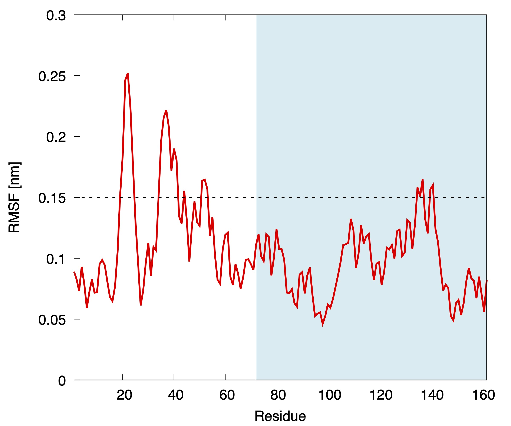

# Input files preparation

In the zip file available in the GitHub repository you will find all the initial files needed to run this tutorial.

## Preliminary molecular dynamics run
As a first step for the VMetaD run, we have to choose the atoms which will constitute the reference frame on which we will calculate the position of the ligand with respect to the protein. To be sure in choosing residues that remain stable (i.e. do not belong to a moving loop), we run a 100 ns-long plain molecular dynamics (MD) simulation (it took 2 h on 4 CPUs of a M1 Max MacBook Pro).

After the simulation, we calculate the per-residue root mean square fluctuations (RMSF), which highlights the more dynamic residues.

<p align="center">
  
  <br>
  <em>Per-residue root mean square fluctuation (RMSF) computed from a plain MD simulation of lysozyme-benzene complex. The portion of the plot with light blue background represents the C-terminal domain, where the benzene binds.</em>
</p>

We can see that almost all the C-terminal domain (residues 71-162) does not show large fluctuations, and only few residues are above the (arbitrary) RMSF threshold of 0.15 nm. We thus consider to define the reference frame considering all the residues 71-162 but the five ones with RMSF > 0.15 nm (residues 135, 136, 137, 140, and 141).

## Choice of the restraining potential size

We now need to choose the size of the restraint potential. In the [original paper](https://doi.org/10.1021/acs.jpclett.9b01183) we showed that the reliability of the estimates is not affected by the size of the potential. However, we have to keep in mind that we need a part of the box where the ligand can stay far away from the protein in order to represent the unbound state in a satisfactory way. An important point here is that the sphere constraint __must__ be inside the box, otherwise the entropic correction will not accurately account for the loss of configurational space. To visually inspect how large the potential is, and to get a feel for the possible movements of the ligand, we can visualize both the system and the restraint with VMD (downloadable [here](https://www.ks.uiuc.edu/Research/vmd/)).

We can open VMD and load the `starting.gro` structure file in the GitHub folder. After the structure is loaded and the visualization has been set up at your taste, you can open the Tk console and write
```
pbc box
```
which draws the cubic box in which the system is inserted. 

Now we can generate the atom selection we defined after checking the RMSF:
```
set sel [atomselect top "resid 71 to 134 or resid 138 to 139 or resid 142 to 162"]
```
The console should answer
```
atomselectXX
```
Where `XX` is a number. The selection for the reference frame has been defined and named `$sel`. Now we can compute the position of the center of mass of this set of atoms:
```
measure center $sel weight mass
```
The console should answer with the position of the center of mass (in Ångstrom)
```
35.28876876831055 34.06196594238281 32.041622161865234
```
Knowing this information, we can draw the sphere with a radius of (for example) 2 nm  (20 Å) with the following command
```
draw sphere {35.28876876831055 34.06196594238281 32.041622161865234} radius 20 resolution 100
```
Receiving a number as an answer from the console. Such number is the ID of the 3D object we just draw. The drawn sphere is opaque, not allowing us to see inside it; to make it transparent, we need to specify that we want a transparent material
```
draw material Transparent
```
We can see that the sphere contains the entire domain, but it is probably too small to represent the unbound state in a precise way. Let's delete the sphere using the ID of the 3D object (let's say that it is `14`), and plot a new sphere of radius 2.8 nm
```
draw delete 14
draw sphere {35.28876876831055 34.06196594238281 32.041622161865234} radius 28 resolution 100
```
You can see the expected result below
<p align="center">
  
  <br>
  <em>Cartoon representation of the lysozyme-benzene complex, including the restraining potential applied within a 2.8 nm radius of the reference frame center of mass. The boundaries of the simulation box are also highlighted to show that the sphere is entirely contained by the box. </em>
</p>

## The C-alpha RMSD restraining
One effect that we should take into account is the possibility that the ligand, in advanced phases of the simulation, will try to unfold the protein, being the place occupied by it the volume portion with less history-dependent potential. To limit this effect we will put in place a RMSD restraining that will be removed during the reweighting procedure. To be sure to keep the structure stable, we will consider all the C-alpha atoms of the residues considered for defining the reference frame. This is not the case, but in presence of partial folding upon binding effects the involved residues can be removed from this restraint. 

To have a reference structure to be used in PLUMED (see the next section for the input file), we convert the initial structure to the PDB format using `gmx editconf`  (to be sure about the numbering) and keeping only the C-alphas:
```
gmx editconf -f starting.gro -o ref_ca.pdb
grep "CA" ref_ca.pdb > tmpfile && mv tmpfile ref_ca.pdb
```
Adding the correct values to the b-factor columns so that PLUMED can consider only the atoms we want to select (see the `ref_ca.pdb` file in the folder for reference).
This PDB file will also be used to perform the rototranslational fit of the host to fix the reference frame (we can also use two different files with different groups of atoms, if necessary).

## The PLUMED input file
_(You can read the following line-by-line description keeping an eye on the `plumed.dat` file in the GitHub folder as a reference)_

We start with the `WHOLEMOLECULES` instruction, to be sure that lysozyme (`ENTITY0`) will not be broken by the periodic boundary condition, as well as the benzene molecule (`ENTITY1`):
```
WHOLEMOLECULES ENTITY0=1-1284 ENTITY1=1285-1290
```
Now that we are sure of the integrity of the structures in PLUMED, we perform the rototranslational fit of the system to make sure that the protein will be in the fixed reference frame position:
```
FIT_TO_TEMPLATE REFERENCE=ref_ca.pdb TYPE=OPTIMAL
```

We then start with the groups definition. We previously prepared a GROMACS index file (`index.ndx`) with all the groups named as intended. As an alternative, you can also define such groups with atom ids.
```
prot_noh: GROUP NDX_FILE=index.ndx NDX_GROUP=Protein-H
sph: GROUP NDX_FILE=index.ndx NDX_GROUP=sphere
lig: GROUP NDX_FILE=index.ndx NDX_GROUP=ligand
```
We have three groups: 
* `prot_noh`, which contains all the non-hydrogen atoms of the protein (for our multi-eGO potential is equivalent to all the protein, but in all-atom representation it makes a difference);
* `sph`, which contains the atoms that define the reference frame;
* `lig`, which contains the atoms of the ligand.

After the definition of the groups, to avoid that the passage in a periodic boundary conditions causes a "jump" of the ligand with respect to the protein, we add a `WRAPAROUND` instruction:
```
WRAPAROUND ATOMS=bnz AROUND=sph
```
Ending the fitting part of the PLUMED input.
