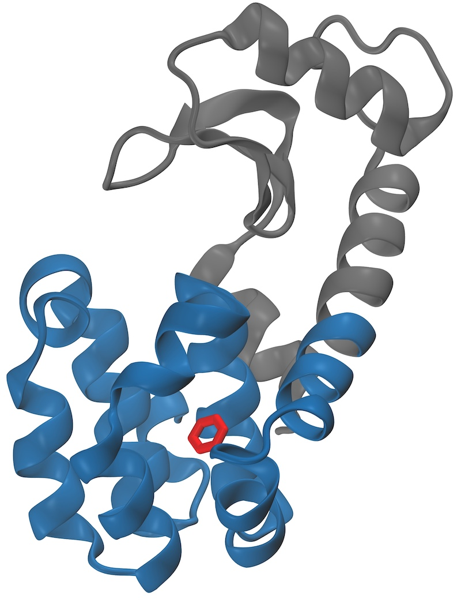

# L99A T4 Lysozyme:benzene complex

The lysozyme T4 L99A variant is a modified form of the lysozyme enzyme derived from bacteriophage T4, a virus that infects Escherichia coli bacteria. In its natural form, lysozyme T4 plays a critical role in breaking down bacterial cell walls by hydrolyzing specific bonds within the polysaccharide chains. However, the L99A variant of this enzyme has been engineered with a specific mutation: the substitution of leucine (L) at position 99 with alanine (A). This seemingly small alteration has significant implications: L99A mutation creates a hydrophobic cavity within the C-terminal domain of the enzyme, which dramatically alters its stability and binding properties. This variant is particularly useful as a model system for studying protein-ligand interactions because the introduced cavity can accommodate small hydrophobic molecules (in particular benzene).  Moreover, the T4 L99A variant has become a benchmark test system for both experimental and computational approaches. It is widely used in experiments to explore the effects of small molecule binding, protein stability under various conditions, and the principles of molecular recognition. From the computational point of view, it serves as a standard model for validating computational methods such as molecular dynamics simulations, docking studies, and free energy calculations. The predictable and well-characterized behavior of the L99A variant makes it an ideal candidate for testing and refining these experimental and computational techniques, contributing significantly to advancements in the understanding of protein chemistry.

In this tutorial, we will use a structure based on the PDB ID [1L84](https://www.rcsb.org/structure/1L84). The force field used is multi-eGO, a structure-based potential generated via a bayesian approach, trained on all-atom simulations performed with the DES-Amber force field (details in [this paper](https://doi.org/10.26434/chemrxiv-2024-jcmgc)). 
The main advantages of multi-eGO relies in three main points
* The possibility to use 5 fs time steps: multi-eGO implements a united-atom coarse-graining, which removes hydrogens;
* Absence of coulombian interactions for electrostatics: in multi-eGO, all the non-bonded interactions are included in a Lennard-Jones potential;
* Implicit solvation: multi-eGO does not have an explicit solvent, resulting in ~10x less particles in the simulation box.

Using this potential we are able to reach on consumer-level hardware the same performances of a HPC machine on all-atom potentials, allowing us to run on a workstation the entire tutorial in around 24 h. 
