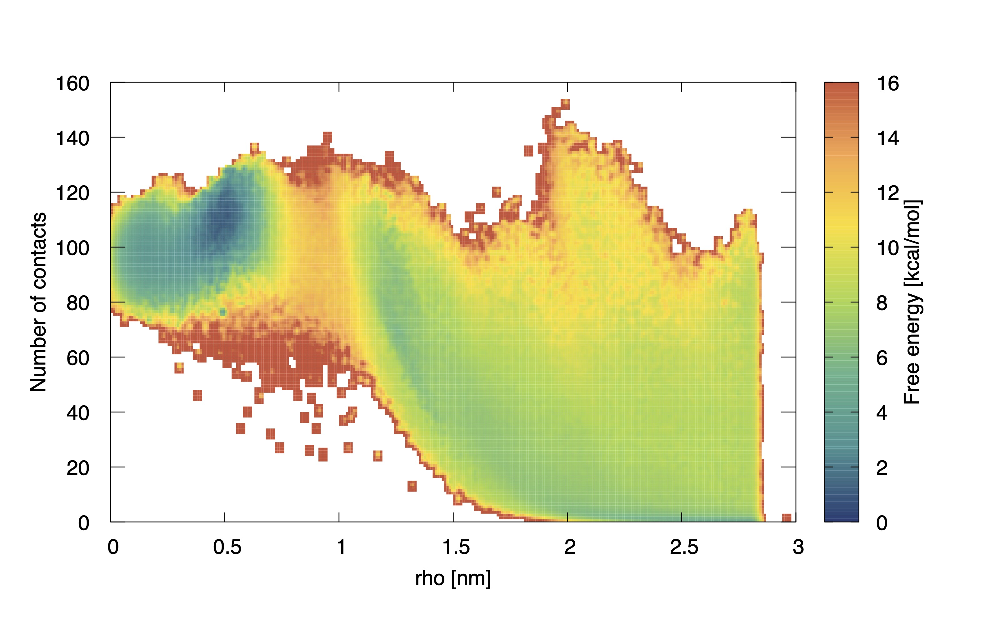

# Post-processing and analysis
Here we assume that you checked the convergence of your system and that all the run ended successfully (no protein unfolding, no other issues). Here we will not focus on convergence, error calculation and metadynamics technical details, considering that such topics are already covered by the [Metadynamics tutorial](https://www.plumed-tutorials.org/lessons/21/004/data/NAVIGATION.html). 

### Reweighting 
After the end of the simulation, we need to reweight our free energy landscape on apt collective variables. As anticipated in the previous step, we will use the distance from the origin of the reference frame $$\rho$$ and the number of contacts $$c$$. We thus prepare step-by-step a reweighting script (you can find it in the GitHub folder, called `reweight.dat`).

We begin from the reading of the relevant data files (refer to the `plumed.dat` file if you do not remember what is contained in them):
```
rho: READ FILE=coord_rho.dat VALUES=rho IGNORE_FORCES IGNORE_TIME
c: READ FILE=coord_rho.dat VALUES=c IGNORE_FORCES IGNORE_TIME
metad: READ FILE=metad_data.dat VALUES=metad.* IGNORE_FORCES IGNORE_TIME
restr_rmsd: READ FILE=rmsd_restraint.dat VALUES=restr_rmsd.* IGNORE_FORCES IGNORE_TIME
```
After loading the data, we have to perform the reweighting of the metadynamics potential via the [Tiwary-Parrinello estimator](https://doi.org/10.1021/jp504920s). Concurrently, we remove the (almost negligible) contribution of the RMSD restraining, obtaining the final weights for the histogram
```
weights: REWEIGHT_BIAS TEMP=300 ARG=metad.rbias,restr_rmsd.bias
```
Having the weights, we can compute the histogram, considering the data from 200 ns to 1 µs to ignore the out-of-equilibrium portion of the simulation:
```
HISTOGRAM ...
  ARG=rho,c
  GRID_MIN=0.,0
  GRID_MAX=3.0,160
  GRID_BIN=300,160
  KERNEL=DISCRETE
  LOGWEIGHTS=weights
  LABEL=histo
  UPDATE_FROM=200000
  UPDATE_UNTIL=1000000
... HISTOGRAM
```
This histogram can be converted to a free energy landscape
```
ff: CONVERT_TO_FES GRID=histo TEMP=300
```
and finally printed
```
DUMPGRID GRID=ff FILE=reweighted_fes.dat
```
From this data we can plot the 2D free energy landscape reweighted on $$\rho$$ and $$c$$:

<p align="center">
  
  <br>
  <em>Free energy surface projected along the new CVs.</em>
</p>

### ∆G calculation
In the GitHub folder you can find a simple python script to get the free energy difference between two basins, `deltaG.py`. You have to input the path of the reweighted FES, the minima and the maxima in x and y for both the basins and it returns the free energy difference. For my run, we defined the two minima and obtained this result:
```
$> python3 deltaG.py reweighted_fes.dat 0.48 0.53 108 115 2. 2.8 0 1
The free energy difference between basin A and basin B is -3.53 kcal/mol
```
We now have $$\Delta G_{\text{MetaD}}$$, the last step is the calculation of the entropic correction.
